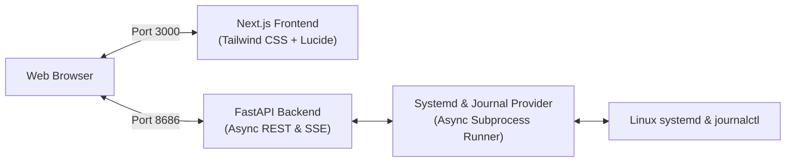

<div align="center">
  
  <p><strong>Modern full-stack systemd service manager &amp; live telemetry dashboard with structured journalctl streaming.</strong></p>
</div>

---

## 📖 About

**systatus** is a lightweight, modern web dashboard designed to simplify Linux system administration. It allows developers and sysadmins to monitor host telemetry, manage custom systemd services (`systemctl`), edit unit configuration files, and stream live journal logs (`journalctl`) in real time through a fast, clean, and theme-adaptive web interface.

---

## ✨ Features

- **Dual-Scope Service Management:** Auto-detects custom systemd services across both System (`/etc/systemd/system/`) and User (`~/.config/systemd/user/`) scopes.
- **Full Lifecycle Operations:** Start, stop, restart, enable, disable, and reset failed units (even crash-looping services).
- **In-Browser Unit File Editor:** View, edit, validate, and safely save `.service` unit files with automatic daemon reloads.
- **Live Journalctl Log Stream:** Real-time, color-coded SSE (Server-Sent Events) live tail with severity priority filtering (`INFO`, `WARNING`, `ERROR`, etc.) and log search.

---

## 🏗️ Architecture



---

## 🚀 Getting Started

### 1. Prerequisites
- **Linux** (Ubuntu, Debian, Fedora, Arch, etc.) with `systemd` and `journalctl`
- **Python** >= 3.10
- **Node.js** >= 18 and `npm`

---

### 2. One-Command Quick Setup ⚡

Clone the repository and run the setup script:
```bash
git clone https://github.com/mdnaimul22/systatus.git
cd systatus

chmod +x setup.sh && ./setup.sh
```

The script automatically:
1. Verifies Python 3.10+ and Node.js/npm
2. Generates `.env` from `.env.example`
3. Installs backend Python dependencies
4. Installs frontend Next.js packages in `web/`

<details>
<summary><b>Or Manual Installation (Click to expand)</b></summary>

```bash
# 1. Backend dependencies
pip install -r requirements.txt

# 2. Frontend dependencies
cd web && npm install && cd ..

# 3. Environment configuration
cp .env.example .env
```
</details>

---

## 🏃‍♂️ Running the Application

Just run:
```bash
python main.py
```

- **In Development (`APP_ENV=development`):** Starts FastAPI with backend hot-reload and Next.js dev server with Turbopack.
- **In Production (`APP_ENV=production`):** Automatically compiles the Next.js bundle if needed, runs the production frontend server, and launches FastAPI in optimized mode.

Open [http://localhost:3000](http://localhost:3000) (or visit [http://localhost:8686](http://localhost:8686), which will automatically redirect to the frontend).

---

## 🧪 Testing

Run backend tests using pytest:
```bash
pytest tests/ -v
```

---

## 📜 License

This project is licensed under the MIT License - see the [LICENSE](LICENSE) file for details.
