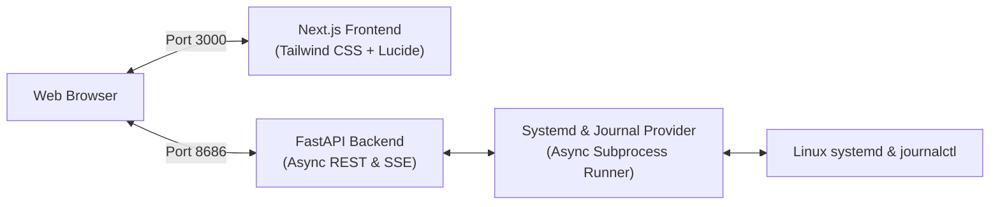

# SysStatus ⚡

> Systemd service manager & live telemetry dashboard with structured journalctl streaming.

SysStatus provides a unified dashboard to monitor, manage, edit, and stream logs for custom Linux services (both **User** and **System** scopes) without touching the command line.

---

## ✨ Features

- **Unified Full-Stack Runner:** Single command `python main.py` orchestrates both the FastAPI backend and Next.js frontend concurrently based on `APP_ENV` (`development` or `production`).
- **Dual-Scope Service Management:** Auto-detects custom systemd services across both System (`/etc/systemd/system/`) and User (`~/.config/systemd/user/`) scopes.
- **Full Lifecycle Operations:** Start, stop, restart, enable, disable, and reset failed units (even crash-looping services).
- **In-Browser Unit File Editor:** View, edit, validate, and safely save `.service` unit files with automatic daemon reloads.
- **Live Journalctl Log Stream:** Real-time, color-coded SSE (Server-Sent Events) live tail with severity priority filtering (`INFO`, `WARNING`, `ERROR`, etc.) and log search.
- **Smart Sudo Elevation:** Auto-detects passwordless sudo (`NOPASSWD`) and provides an on-demand modal password prompt for standard users.
- **Bulletproof Port Management:** Multi-strategy socket cleaner (`fuser`, `ss`, `pkill -P`) preventing `EADDRINUSE` errors on restarts.

---

## 🏗️ Architecture



---

## 🚀 Getting Started

### 1. Prerequisites
- **Linux** (Ubuntu, Debian, Fedora, Arch, etc.) with `systemd` and `journalctl`
- **Python** >= 3.10
- **Node.js** >= 18 and `npm`

### 2. Installation

Clone the repository and install backend dependencies:
```bash
git clone https://github.com/mdnaimul22/systatus.git
cd systatus

# Backend dependencies
pip install -r requirements.txt

# Frontend dependencies
cd web && npm install && cd ..
```

### 3. Configuration
Copy `.env.example` to `.env`:
```bash
cp .env.example .env
```
Default settings:
```env
APP_ENV=development
API_HOST=127.0.0.1
API_PORT=8686
FRONTEND_URL=http://localhost:3000
```

---

## 🏃‍♂️ Running the Application

Just run:
```bash
python main.py
```

- **In Development (`APP_ENV=development`):** Starts FastAPI with backend hot-reload and Next.js dev server with Turbopack.
- **In Production (`APP_ENV=production`):** Automatically compiles the Next.js bundle if needed, runs the production frontend server, and launches FastAPI in optimized mode.

Open [http://localhost:3000](http://localhost:3000) (or visit [http://localhost:8686](http://localhost:8686), which will automatically redirect to the frontend).

---

## 🧪 Testing

Run backend tests using pytest:
```bash
pytest tests/ -v
```

---

## 📜 License

This project is licensed under the MIT License - see the [LICENSE](LICENSE) file for details.
